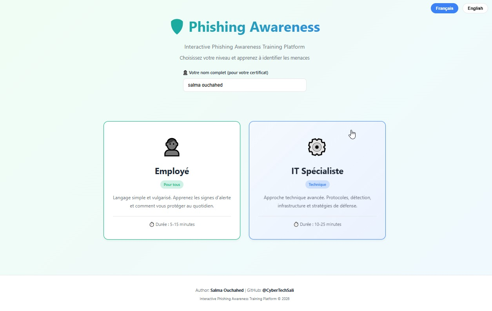
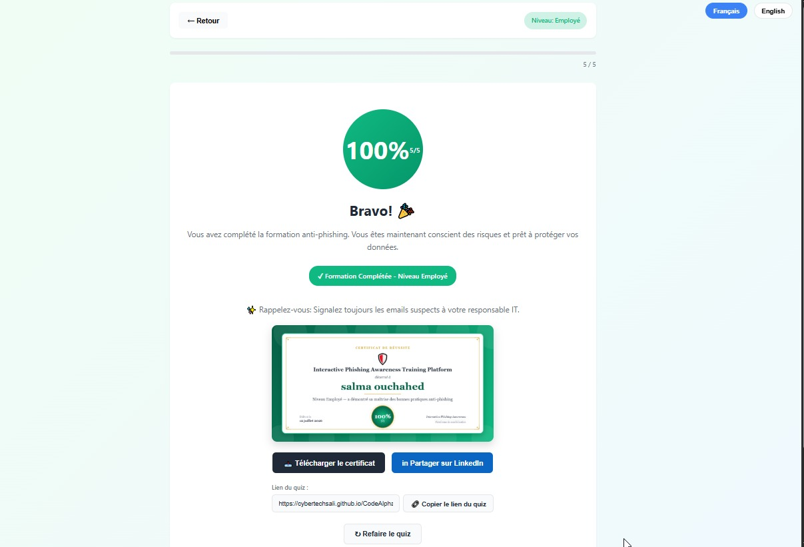
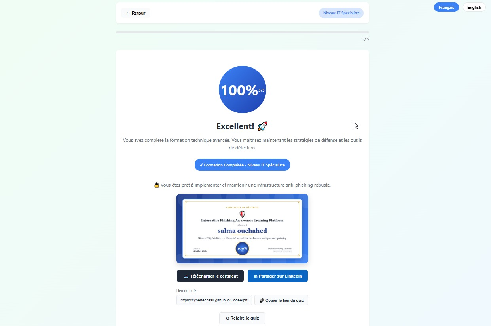

# 🛡️ Interactive Phishing Awareness Training Platform

An interactive, bilingual (French/English) phishing awareness
training platform, featuring two tailored learning paths
(Employee / IT Specialist), a scored quiz, and a shareable
completion certificate.

🔗 **[Try the live demo](https://your-username.github.io/interactive-phishing-awareness-training/)**

---

## 📸 Preview

<table>
  <tr>
    <td align="center"><b>Home Screen</b></td>
  </tr>
  <tr>
    <td align="center"></td>
  </tr>
  <tr>
    <td align="center">Choose your level and enter your name</td>
  </tr>
</table>

 

<table>
  <tr>
    <td align="center"><b>Employee Certificate</b></td>
    <td align="center"><b>IT Specialist Certificate</b></td>
  </tr>
  <tr>
    <td></td>
    <td></td>
  </tr>
  <tr>
    <td align="center">Awarded after completing the Employee track</td>
    <td align="center">Awarded after completing the IT Specialist track</td>
  </tr>
</table>
---

## ✨ Features

- 🌍 **Bilingual**: instant switch between French and English
- 👤 **Two training levels**:
  - Employee — simple, non-technical language (5-15 min)
  - IT Specialist — advanced technical approach: SPF, DKIM,
    DMARC, defense architecture, forensics (10-25 min)
- 📝 **Real-time scored quiz** with immediate per-question feedback
- 🎯 **Percentage-based score** with a 70% pass threshold
- 🏆 **Auto-generated completion certificate** (image),
  personalized with the participant's name, level completed,
  and score achieved
- 📤 **Sharing**: certificate download, native share (mobile),
  and quiz link copy
- 📱 **Responsive**: works on mobile, tablet, and desktop

## 🧠 Training Content

**Employee Level**
- What phishing is and why you're targeted
- The 5 warning signs of a phishing email
- Identifying fake websites (HTTPS, padlock, URL)
- Social engineering tactics and safe reflexes

**IT Specialist Level**
- Anti-phishing architecture (SPF / DKIM / DMARC)
- Technical analysis of attack vectors (header spoofing,
  typosquatting, URL obfuscation)
- Recommended security stack (rspamd, ClamAV, PhishTank...)
- Monitoring, KPIs, and incident response

## 🛠️ Tech Stack

- Vanilla HTML5 / CSS3 / JavaScript (no dependencies)
- Canvas API for certificate generation
- Web Share API for native sharing
- 100% client-side — free to host on GitHub Pages

## 🚀 Running Locally

No installation required:
git clone https://github.com/your-username/interactive-phishing-awareness-training.git
cd interactive-phishing-awareness-training

Just open `index.html` in your browser.

## 📄 License

This project is licensed under the MIT License — free to use,
modify, and distribute.

## 👤 Author

**Salma Ouchahed**
GitHub: [@CyberTechSali](https://github.com/CyberTechSali)
